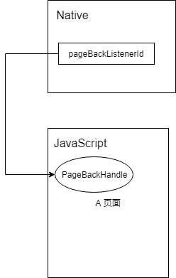
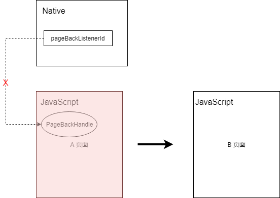

# GZB JSSDK 接口协议

当前版本: 1.2.0

<!-- TOC -->

- [GZB JSSDK 接口协议](#gzb-jssdk-接口协议)
  - [1. 概述](#1-概述)
  - [2. 接口规范](#2-接口规范)
    - [1.1 请求数据](#11-请求数据)
    - [1.2 返回数据](#12-返回数据)
    - [1.3 示例](#13-示例)
  - [3. 正式接口列表](#3-正式接口列表)
    - [设置标题(setTitle)](#设置标题settitle)
    - [打电话(makecalltonumber)](#打电话makecalltonumber)
    - [发短信](#发短信)
    - [发送邮件(openMail)](#发送邮件openmail)
    - [打开链接(openUrl)](#打开链接openurl)
    - [打开名片(openContactItem)](#打开名片opencontactitem)
    - [选择联系人(openContact)](#选择联系人opencontact)
    - [设置状态栏颜色(setBarColor)](#设置状态栏颜色setbarcolor)
    - [显示和隐藏状态栏(showBar)](#显示和隐藏状态栏showbar)
    - [设置状态栏(setBar)](#设置状态栏setbar)
    - [退出Web App 应用(exitWebApp)](#退出web-app-应用exitwebapp)
    - [获取当前位置(getLocation)](#获取当前位置getlocation)
    - [导航](#导航)
    - [获取应用信息(apiList)](#获取应用信息apilist)
    - [获取应用当前语言(getLanguage)](#获取应用当前语言getlanguage)
    - [扫码(scanQRCode)](#扫码scanqrcode)
    - [分享(shareTo)](#分享shareto)
    - [打开会话框(openDialog)](#打开会话框opendialog)
    - [选择会话(selectSession)](#选择会话selectsession)
    - [图片选择器(chooseImg)](#图片选择器chooseimg)
    - [图片预览接口](#图片预览接口)
    - [文件打开接口](#文件打开接口)
    - [自定义‘更多’按钮菜单](#自定义更多按钮菜单)
  - [4. 更新计划/进度](#4-更新计划进度)
    - [1.1.1](#111)
      - [获取当前环境信息](#获取当前环境信息)
    - [1.2.0](#120)
      - [打开视频](#打开视频)
    - [1.3.0](#130)
      - [打开图片增加参数](#打开图片增加参数)
      - [JSSDK状态清理提案](#jssdk状态清理提案)
        - [动机](#动机)
        - [处理策略: 异常回退](#处理策略-异常回退)
        - [处理策略: 状态清理](#处理策略-状态清理)
      - [新接口规范](#新接口规范)
    - [1.4.0](#140)
      - [选择会话(selectSession)优化](#选择会话selectsession优化)
  - [5. 历史记录](#5-历史记录)

<!-- /TOC -->

## 1. 概述

* JSSDK是工作宝向网页开发者提供的基于工作宝客户端的网页开发工具包。
* 通过使用JSSDK，网页开发者可借助工作宝客户端高效地使用拍照、选图、位置等手机系统的能力，为工作宝用户提供更优质的网页体验。

## 2. 接口规范

### 1.1 请求数据

`JSON`字符串数据，例如:

```json
{
  "multiple": true,
  "title": ""
}
```

### 1.2 返回数据

返回json字符串数据，里面的具体内容如下

```js
{
  "result": "true",     // -> 字符串类型，'true'表示成功 'false'表示失败
  "errCode": 701,       // -> 错误码，当result为'false'时才有
  "errMsg": "选择失败",  // -> 错误信息，当result为'false'时才有
  // ... 每个接口相应返其他需要的数据
}
```

### 1.3 示例

```js
  /*
   * selectSession
   * 选择会话（单聊，群聊）
   *
   * Parameters:
   *  @param multiple boolean 是否可以多选，true多选，false单选 默认false
   *  @param title string 选择会话界面的标题 为空时默认值“请选择目标”
   *
   * Return Value:
   * 成功
   * {
   *   "result":"true",
   *   "session":[
   *     {"sessionId":"u151855","sessionType":"user"},
   *     {"sessionId":"jf-mai","sessionType":"user"},
   *     {"sessionId":"1437103167643903556_room","sessionType":"chatroom"}
   *   ]
   * }
   *
   * 取消选择时
   * {"errCode":704,"errMsg":"","result":"false","session":null}
   * 错误码具体看下面表格说明
   *
   * 具体实现例子如下;
   */
  WebViewJavascriptBridge.callHandler(
    'selectSession',
    {
      multiple:true,
      title:''
    },
    function (response) {
			let re
			if (typeof response === 'string') {
        re = JSON.Parse(response);
			} else {
				re = response
			}
    }
  )
```

|错误码(errCode)|错误信息(errMsg)|描述|
|-----|-----|-----|
|701|选择失败|未知异常错误|
|704|取消选择|用户主动取消了选择|

## 3. 正式接口列表

### 设置标题(setTitle)

* 名称: setTitle
* 描述：设置状态栏标题
* 平台: `IOS` | `ANDROID` | `PC`
* 请求:
```
{
	title: string // 标题名
}
```
* 响应: 无


[⬆返回顶部](#gzb-jssdk-接口协议)

---

### 打电话(makecalltonumber)

* 名称: makeCallToNumber
* 描述: 客户端app接收电话号码后使用网络拨打该号码
* 平台: `ios` | `android` | `pc`
* 请求：
```
{
	callnumber: string // 电话号码
}
```
* 响应: (目前三端都没有回调响应)
```
{
  "result": "true",     // -> 字符串类型，'true'表示成功 'false'表示失败
  "errCode": number,       // -> 错误码, 待协定
  "errMsg": string,  // -> 错误信息，待协定
}
```

[⬆返回顶部](#gzb-jssdk-接口协议)

---

### 发短信

* 名称: sendSmsToNumber
* 描述: 调出手机原生发送短信界面，发送目标手机号为接口中设置的电话号码   
* 平台: `ios` | `android`
* 请求：
```
{
	callnumber: string | string[] // 电话号码, (提议)callNumber 支持传入数组，以支持群发功能
	content: string,              // (提议) 允许自定义消息内容
}
```
* 响应: (目前三端都没有回调响应)
```
{
  "result": "true",     // -> 字符串类型，'true'表示成功 'false'表示失败
  "errCode": number,       // -> 错误码, 待协定
  "errMsg": string,  // -> 错误信息，待协定
}
```

[⬆返回顶部](#gzb-jssdk-接口协议)

---

### 发送邮件(openMail)

* 名称: openMail
* 描述: 调出原生邮箱发送页面
* 平台: `ios` | `android` | `PC`
* 请求：
```
{
	email: string | string[]      // 电话号码, (提议)支持传入数组，以支持群发
	cc: string[],                 // (提议) 支持抄送
	subject: string,              // (提议) 支持设置主题
	content: string,              // (提议) 允许自定义消息内容
}
```
* 响应: (目前三端都没有回调响应, 待协定)
```
{
  "result": "true",     // -> 字符串类型，'true'表示成功 'false'表示失败
  "errCode": number,       // -> 错误码, 待协定
  "errMsg": string,  // -> 错误信息，待协定
}
```

[⬆返回顶部](#gzb-jssdk-接口协议)

---

### 打开链接(openUrl)

* 名称: openUrl
* 描述: 使用新建工作宝APP窗口或使用系统默认浏览器打开指定链接
* 平台: `ios` | `android` | `PC`
* 请求：
```
{
	url: string,                // URL 链接
	showMode: 'outer' | 'inner' // 打开方式， outer 使用系统自带浏览器打开， inner新建工作宝窗口打开
}
```
* 响应: 无

[⬆返回顶部](#gzb-jssdk-接口协议)

---

### 打开名片(openContactItem)

* 名称: openContactItem
* 描述: 根据用户id打开用户的名片页面
* 平台: `ios` | `android` | `PC`
* 请求：
```
{
	id: string      // 用户id
}
```
* 响应: (目前三端都没有回调响应, 待协定)
```
{
  "result": "true",     // -> 字符串类型，'true'表示成功 'false'表示失败
  "errCode": number,    // -> 错误码, 待协定
  "errMsg": string,     // -> 错误信息，待协定
}
```

[⬆返回顶部](#gzb-jssdk-接口协议)

---

### 选择联系人(openContact)

* 名称: openContact
* 描述: 打开联系人选择器
* 平台: `ios` | `android` | `PC`
* 请求：
```
{
	user: Array<{id: string, name: string}>,  // 当前已选中的联系人
	tenementId: string,                       // 企业id
	limit: number,                            // 选择的上限， 只有multiple为true时有效
	unselect: boolean,                        // 表示是否可以取消已选择的联系人
	type: 'single' | 'multiple',              // 选择模式， multiple为多选模式
}
```
* 响应: 
```
array<{
  id: string                                // 用户id
  name: string                              // 用户名
  avatar: string	                          // 用户头像链接
}>

（提议）响应：
{
  "result": "true",     // -> 字符串类型，'true'表示成功 'false'表示失败
  "errCode": number,    // -> 错误码, 待协定
  "errMsg": string,     // -> 错误信息，待协定
	"data": array<{
  id: string            // 用户id
  name: string          // 用户名
  avatar: string        // 用户头像链接
}>
}
```

[⬆返回顶部](#gzb-jssdk-接口协议)

---

### 设置状态栏颜色(setBarColor)
* 名称: setBarColor
* 描述: 设置状态栏颜色
* 平台: `ios` | `android`
* 请求：
```
{
	color: string,       // 颜色值，(提议)目前只支持#HEX格式的颜色值， 提议支持rgb，rgba， color name等颜色值
}
```
* 响应：无


[⬆返回顶部](#gzb-jssdk-接口协议)

---

### 显示和隐藏状态栏(showBar)
* 名称: showBar
* 描述: 显示和隐藏状态栏
* 平台: `ios` | `android`
* 请求：
```
{
	flag: boolean,      // flag 为false时隐藏 
}
```
* 响应：无


[⬆返回顶部](#gzb-jssdk-接口协议)

---

### 设置状态栏(setBar)
* 名称: setBar
* 描述: 显示和隐藏状态栏按钮，绑定按钮点击事件
* 平台: `ios` | `android`
* 请求：
```
type ButtonId = 'close' | 'goback'
{
	hideMoreBtn: 'true' | 'false', // 显示和隐藏更多按钮，（已知问题）, 设置为false，或true会导致应用崩溃
	left: [ButtonId, ButtonId],    // 显示和隐藏返回和关闭按钮，（已知问题）close, goback 只能同时关闭一个
	onlyCallback: ButtonId[],      // 绑定goback或close点击回调
	gobackUrl: string,             // 返回按钮绑定的url
	right: string,                 // 右边按钮 替换文字
}
```
* 响应：
```
{
	"result": "true" | "false",    // 状态，(已知问题) 描述不清晰
	"buttonId": ButtonId,          // 触发事件的按钮
	"buttonName": string,          // 按钮名， (提议)移除
}
```

> 提议: 这个接口职责过重， 建议拆分为多个接口进行调用. 统一PC端和移动端相关接口


[⬆返回顶部](#gzb-jssdk-接口协议)

---

### 退出Web App 应用(exitWebApp)

* 名称: exitWebApp
* 描述: 退出WebApp应用， 即关闭窗口
* 平台: `ios` | `android` | `PC`
* 请求：无
* 响应：无


[⬆返回顶部](#gzb-jssdk-接口协议)

---

### 获取当前位置(getLocation)

* 名称: getLocation
* 描述: 获取用户当前位置
* 平台: `ios` | `android`
* 请求：

```
{
	enableHignAccuracy: boolean // (提议) 启用高精度
	timeout: number,            // (提议) 超时，毫秒
  watch: boolean,             // (Since 1.1.0) 监视模式(为true时进入监视模式，浏览器端会持续进行请求， 原生可以对其进行针对性优化), 默认为false
	// 其他
}
```
* 响应：

```
/**
 * 地图坐标类型，在中国地区，所有地图的坐标都是经过加密的, 中国地区以外都是GPS坐标
 * + WGS84 是GPS坐标
 * + GCJ02 是火星坐标，在中国地区，高德、GoogleMap都是使用这个格式的坐标
 * + BD08 百度坐标
 */
type CoordType = 'WGS84' | 'GCJ02' | 'BD09'

{
  "result": "true",     // (提议) 字符串类型，'true'表示成功 'false'表示失败
  "errCode": number,    // (提议) 错误码, 待协定
  "errMsg": string,     // (提议) 错误信息，待协定
	latitude: number,
	longitude: number,
	coordType: CoordType, // 坐标类型(Since 1.1.0)
	accuracy: number,     // 精度(Since 1.1.0)
	address: string,      // 反向解析的中文地址
  speed: number,        // 速度(Since 1.1.0)
}
```

| 错误码  | 描述 |
|--------|------|
|401 | 没有权限 |
|402 | 超时 |
|403 | 位置不可用 |

[⬆返回顶部](#gzb-jssdk-接口协议)

---

### 导航

* 名称: geoNavigate
* 支持版本：`1.1.0`
* 描述：导航
* 平台： `Android` | `IOS`
* 场景：吊起原生地图应用进行导航
* 请求：

```
{
  to: {
    latitude: number,
    longitude: number,
    address: string
  },
  from: {
    latitude: number,
    longitude: number,
    address: string,
  }
 /**
  * 地图坐标类型，在中国地区，所有地图的坐标都是经过加密的, 中国地区以外都是GPS坐标
  * + WGS84 是GPS坐标, HTML5位置接口返回的格式
  * + GCJ02 是火星坐标，在中国地区，高德、GoogleMap都是使用这个格式的坐标
  * + BD08 百度坐标
  */
  coordType: 'WGS84',
}
```

* 响应
```
{
  "result": "true",     // 字符串类型，'false'表示添加失败, 'true'表示菜单项被点击
  "errCode": number,    // 错误码(默认402)
  "errMsg": string,     // 错误信息
}
```

| 错误码  | 描述 |
|--------|------|
|401 | 没有安装地图 |
|402 | 导航失败 |

---

[⬆返回顶部](#gzb-jssdk-接口协议)

### 获取应用信息(apiList)
* 名称: apiList
* 描述: 获取应用信息， 支持API列表
* 平台: `ios` | `android` | `PC`
* 请求：无
* 响应：
```
{
	platform: 'ios' | 'pc' | 'android' | 'macos', // (提议) 平台名
	version: string,                              // (提议) 当前版本
	apiList: string[],                            // (提议) 支持API列表
}
```


[⬆返回顶部](#gzb-jssdk-接口协议)

---

### 获取应用当前语言(getLanguage)
* 名称: getLanguage
* 描述: 获取应用当前语言， 用于国际化支持
* 平台: `ios` | `android` | `PC`
* 请求：无
* 响应：
```
{
  language: string,
}
```
错误码说明

|错误码errCode| 错误信息errMsg |描述 |
|-------------|----------------|-------|
|701	|获取语言失败	|未知异常时提示 |


[⬆返回顶部](#gzb-jssdk-接口协议)

---

### 扫码(scanQRCode)
* 名称: scanQRCode
* 描述: 扫二维码
* 平台: `ios` | `android`
* 请求：
```
{
	needResult: boolean, // 是否返回结果
}
```
* 响应：
```
{
	content: string,     // 返回结果
}
```


[⬆返回顶部](#gzb-jssdk-接口协议)

---

### 分享(shareTo)
* 名称: shareTo
* 描述: 分享
* 平台: `ios` | `android`
* 请求： 无
> 提议：目前这个接口可用性不高， 只能分享工作宝APP， 提议可以自定义分享内容和图片
* 响应：无


[⬆返回顶部](#gzb-jssdk-接口协议)

---

### 打开会话框(openDialog)

* 名称: openDialog
* 描述: 打开会话框， 支持公告、单聊， 群聊
* 平台: `ios` | `android` | `PC`
* 请求： 
```
{
  type: 1 | 2 | 3 | 4    // 1群聊，2 单聊， 3 公告广播, 4, 访客
  id: string             // 会话id， 群组或用户id
  messageId?: string     // 消息记录id
}
```
当messageId不为空时：

|  本地数据库 | 操作  | toast提示 |
|------------|--------|---------|
|有且在7天内  | 打开会话窗,定位到该条记录| 无 |
|有但不在7天内 | 请下拉加载或搜索查看该条记录 |
| 无          | 打开会话窗 |

* 响应：
> 提议: 回调响应是否打开成功

[⬆返回顶部](#gzb-jssdk-接口协议)

---

### 选择会话(selectSession)
* 名称: selectSession
* 描述: 会话选择器
* 平台: `ios` | `android` | `PC`
* 请求： 
```
{
  multiple: boolean      // 表示是否允许多选
  title: string          // 对话框title
}
```
* 响应：
```
{
  "result": "true",     // 字符串类型，'true'表示成功 'false'表示失败
  "errCode": number,    // 错误码
  "errMsg": string,     // 错误信息
  "session": Array<{    // 返回结果
    sessionId: string,  // 会话id
    sessionType: 'user' | 'chatroom'  // 会话类型
  }>
}
```
错误码说明:

|错误码errCode	|错误信息errMsg |	描述 |
|--------------|--------------|------|
|701	 | 选择失败 |	未知异常时提示 |
|704 |	用户取消选择 |	用户主动取消选择会话时提示 |

[⬆返回顶部](#gzb-jssdk-接口协议)

---

### 图片选择器(chooseImg)
* 名称: chooseImg
* 描述: 打开原生相册或相机， 进行图片选择
* 平台: `ios` | `android` | `PC`
* 请求： 
```
{
  quality?: number;      // 图片质量，1 - 100
  target?: number;       //设置缩放后的边大小
  targetType?: 'default' | 'width' | 'height'; //设置target应用到的边, 默认为default
  // (提议) 操作类型， camera 打开相机， gallery打开相册. 默认为default，弹出一个actionsheet， 由 * 用户自主选择
  actionType?: 'default' | 'camera' | 'gallery'; 
  extType?: ImageType[]; // 图片扩展名类型
  maxSizeKb?: number;    // 最大体积， 单位为kb
}
```
缩放参数示例:

|说明 |	targetType |	图片尺寸 |	target |	缩放后尺寸 |
|-----|------------|----------|----------|-----------|
|按最长进行等比例缩放 |default | 800*600 | 400 |400*300 |
|按宽度等比例缩放 | width | 800*600 | 200 |	800/3*200 |
|按高度等比例缩放 | height | 800*600 |200 |	200*600/4 |
执行顺序： 先进行质量压缩，再进行尺寸缩放；
压缩: 只对jpg,jpeg,png进行质量压缩;

* 响应：
```
{

  "result": "true",     // 字符串类型，'true'表示成功 'false'表示失败
  "errCode": number,    // 错误码
  "errMsg": string,     // 错误信息
  quality: number;      // 图片质量
  imgData: string;      // base64 字符串
  name?: string;        // (提议)图片文件名
  imgType: ImageType;   // 图片扩展类型
  imgWidth: number;
  imgHeight: number;
}
```
错误码说明

|errCode	| errMsg |	描述 |
|------|-----------------|-------|
|701|	图片选择失败 |	读取图片异常时提示 |
|702|	请选择[extType](png,jpg)类型图片	| extType有设置时，提示 |
|703|	图片原始大小超过[maxSizeKb]kb |	图片原始大小超过maxSizeKb时提示 |
|704|	用户取消选择 | 用户主动取消选择图片时提示 |
|705|	图片压缩失败 | quality有设置,进行压缩失败时提示 |
|706|	图片缩放失败 | 进行缩放失败时提示 |

[⬆返回顶部](#gzb-jssdk-接口协议)

### 图片预览接口
* 名称: previewImg
* 描述: 打开原生图片预览窗口， 预览指定图片
* 场景：审批应用附件图片预览
* 平台: `ios` | `android` | `PC`
* 请求： 
```
{
  url: string[],   // 需要预览的图片链接数组
  index: number,   // 当前显示的图片索引， 索引从0开始
}
```

* 响应
```
{
  "result": "true",     // 字符串类型，'true'表示成功 'false'表示失败
  "errCode": number,    // 错误码
  "errMsg": string,     // 错误信息
}
```

错误码说明

|errCode	| errMsg |	描述 |
|------|-----------------------|-------|
|701 |	请求数据格式错误， 比如不是合法的链接 |
|702 |	其他错误, 原生内部错误 |

### 文件打开接口
* 名称: openFile
* 描述：打开原生文件预览程序，下载和预览指定文件
* 场景：审批应用预览附件
* 平台： `PC`
* 请求：
```
{
  url: string,      // 文件url
}
```

* 响应
```
{
  "result": "true",     // 字符串类型，'true'表示成功 'false'表示失败
  "errCode": number,    // 错误码
  "errMsg": string,     // 错误信息
}
```

|errCode	| errMsg |	描述 |
|------|-----------------------|-------|
|701 |	请求数据格式错误， 比如不是合法的链接/路径 |
|702 |	文件下载失败 |
|703 |	无法预览，比如没有合适的程序打开文件 |
|704 | 用户取消 |

----

### 自定义‘更多’按钮菜单
添加按钮

* 名称: addMenuItem
* 描述：添加菜单项
* 平台： `Android` | `IOS` | `PC`
* 请求：
```
{
  id: string           // 唯一的按钮id
  title: string        // 按钮显示文字
}
```

* 响应
```
{
  "result": "true",     // 字符串类型，'false'表示添加失败, 'true'表示菜单项被点击
  "errCode": number,    // 错误码(默认402)
  "errMsg": string,     // 错误信息
}
```
> 注意：由于JS回调在点击调用后， 会被JS bridge处理器的释放掉， 导致第二次点击触发时无法调用
> JS 回调. 所以这里的解决办法时允许对同一个id重复添加。如果id已存在，则更新callbackId

---

* 名称: removeMenuItem
* 描述：移除菜单项
* 平台： `Android` | `IOS` | `PC`
* 请求：
```
{
  ids: string[],           // id数组
}
```

* 响应: 无

---

* 名称: setNativeMenuItem
* 描述：设置原生菜单项
* 平台： `Android` | `IOS` | `PC`
* 场景： web页面根据需要显示和隐藏“分享”按钮
* 请求：
```
{
  id: string,       // 原生按钮id
  visible: boolean, // 为true时显示，为false时隐藏
}
```
可用id：

| id     | 描述 |
|--------|------|
|refresh | 刷新按钮 |
|share | 分享按钮 |
|copyLink | 复制链接按钮 |
|openWithBrowser | 浏览器打开按钮 |

* 响应: 无
----

## 4. 更新计划/进度

### 1.1.1

#### 获取当前环境信息

* 名称: getEnvironment
* 描述: 获取用户当前环境
* 平台: `ios` | `android` | `pc`
* 请求：无
* 响应：
```
{
  version: string,   // 工作宝版本
  clientType: 'qxAndroid' | 'qxIOS' | 'qxWindows' | 'qxMAC' | 'qxAndroidFT'  // 终端类型
  apiList: string[], // 支持的接口列表
}
```

### 1.2.0

#### 打开视频

* 名称: openVideo
* 描述：播放指定视频
* 平台: `ios` | `android` | `pc`
* 请求：
```
  {
    url: string,      // 视频链接
    extType?: string, // 扩展名(如.mp4), 可选，默认为.mp4
  }
```
* 响应：无， 由客户端自行提示

[⬆返回顶部](#gzb-jssdk-接口协议)

### 1.3.0

#### 打开图片增加参数

新增`returnExt`请求参数

* 名称: chooseImg
* 描述: 打开原生相册或相机， 进行图片选择
* 平台: `ios` | `android` | `PC`
* 请求： 
```
{
  quality?: number;      // 图片质量，1 - 100
  target?: number;       //设置缩放后的边大小
  targetType?: 'default' | 'width' | 'height'; //设置target应用到的边, 默认为default
  // (提议) 操作类型， camera 打开相机， gallery打开相册. 默认为default，弹出一个actionsheet， 由 * 用户自主选择
  actionType?: 'default' | 'camera' | 'gallery'; 
  extType?: ImageType[]; // 图片扩展名类型(用于选择指定格式的图片)
  returnExt?: ImageType; // 可选，选中后返回的图片格式(如果没有指定, 默认返回jpeg类型)
  maxSizeKb?: number;    // 最大体积， 单位为kb
}
```
缩放参数示例:

|说明 |	targetType |	图片尺寸 |	target |	缩放后尺寸 |
|-----|------------|----------|----------|-----------|
|按最长进行等比例缩放 |default | 800*600 | 400 |400*300 |
|按宽度等比例缩放 | width | 800*600 | 200 |	800/3*200 |
|按高度等比例缩放 | height | 800*600 |200 |	200*600/4 |
执行顺序： 先进行质量压缩，再进行尺寸缩放；
压缩: 只对jpg,jpeg,png进行质量压缩;

* 响应：
```
{

  "result": "true",     // 字符串类型，'true'表示成功 'false'表示失败
  "errCode": number,    // 错误码
  "errMsg": string,     // 错误信息
  quality: number;      // 图片质量
  imgData: string;      // base64 字符串
  name?: string;        // (提议)图片文件名
  imgType: ImageType;   // 图片扩展类型
  imgWidth: number;
  imgHeight: number;
}
```
错误码说明

|errCode	| errMsg |	描述 |
|------|-----------------|-------|
|701|	图片选择失败 |	读取图片异常时提示 |
|702|	请选择[extType](png,jpg)类型图片	| extType有设置时，提示 |
|703|	图片原始大小超过[maxSizeKb]kb |	图片原始大小超过maxSizeKb时提示 |
|704|	用户取消选择 | 用户主动取消选择图片时提示 |
|705|	图片压缩失败 | quality有设置,进行压缩失败时提示 |
|706|	图片缩放失败 | 进行缩放失败时提示 |

[⬆返回顶部](#gzb-jssdk-接口协议)

#### JSSDK状态清理提案

##### 动机
目前`原生JSSDK`在不同页面跳转时并不会重置JSSDK的状态，这会导致一些严重的BUG，比如在`JSSDK的受控页面`中添加了返回事件监听，
这时候跳转到另一个页面时，返回按钮就失效了。再比如受控页面添加了`更多菜单`， 这时候跳转到Google页面，这些`更多菜单`依旧存在。

究其原因是因为原生的JSSDK状态是全局性的，从而导致不同页面干扰和状态互窜. 以图为例:

A页面携带`callbackId`请求捕获点击`返回按钮`事件, 接着原生JSSDK就会保存A页面的callbackId，当用户点击返回按钮时，就拿着这个callbackId通知页面。



现在A页面点击链接跳转到B页面。A页面内存会被马上回收。但原生JSSDK状态还引用着属于A页面的callbackId, 导致在B页面点击返回按钮没有响应。



##### 处理策略: 异常回退

如果原生JSSDK支持捕获调用异常, 应该回退到默认行为。比如点击返回按钮回调调用失败，就按照默认的行为返回上一页。

##### 处理策略: 状态清理

JSSDK状态对于每一个页面都应该是私有的，状态清理是最简单的实现方式。`Webview`加载页面一般会触发两个事件, 因为不同平台命名不一样， 暂且定为`LoadStart`和`Load`.

* LoadStart: 每个页面开始加载时触发。这个事件触发时原生会向页面注入JSSDK代码。
* Load: 一个页面加载完毕。一个全新页面的刷新或跳转都会触发这个事件。但是前端路由的跳转是不会触发这个事件的。

<br/>
<br/>

针对不同的路由类型，触发过程如下：
* 传统后端路由, 每次跳转都会触发LoadStart和Load, 因为是直接请求后端获取全新的页面.
```
 +  `/a`           ==> LoadStart
 |                 ==> Load
 +--> 跳转到 `/b`  ==> LoadStart
                   ==> Load
```
测试地址: 常见网站

* hash类型前端路由(以hash片段作为路由), 第一次页面加载会触发Load和LoadStart，后续的页面跳转只会触发LoadStart

```
 +  `#/a`          ==> LoadStart
 |                 ==> Load
 +--> 跳转到 `#/b`  ==> LoadStart
 |
 +--> 跳转到 `#/c`  ==> LoadStart
```

测试地址：直接使用[JSSDK DEMO](http://demo.ejiahe.com/api/demo/)

* HTML5 History类型前端路由, 只有第一次页面加载时才会触发Load和LoadStart， 后续页面跳转不会触发事件。
```
 +  `/a`          ==> LoadStart
 |                 ==> Load
 +--> 跳转到 `/b`
 |
 +--> 跳转到 `/c`
```

测试地址: [React router](https://reacttraining.com/react-router/web)

<br/>
<br/>
那么何时进行清理呢？ <br/>

由上面的示例可以看到，在Load事件触发时进行清理是比较理想的，因为它适用于两种前端路由类型。但是Load事件可能会‘误杀’部分JSSDK调用，因为页面可能在Load事件触发之前就开始调用JSSDK了，如果在这个时候清理，这些调用就会失效。考虑到生产环境已经有较多应用使用这种方式，所以基于Load事件进行清理不太可行。

所以只有LoadStart时进行清理，而且原生JSSDK也是在这个事件触发时向页面注入JSSDK调用库的。所以对于原生JSSDK可以考虑在向页面注入JSSDK调用库之前进行清理。对于前端的要求是使用基于HTML5 History方式进行部署, 这种部署方式大部分服务器都支持。

> Android端目前已经按照这种方式进行清理, 其他平台可以参考其实现

<br/>
<br/>
清理那些状态? <br/>

目前涉及到的状态有：
* 关闭按钮，返回按钮
* 状态栏颜色，显示、隐藏状态
* 自定义菜单等


[⬆返回顶部](#gzb-jssdk-接口协议)

#### 新接口规范

由于历史原因，目前的接口协议非常不规范，为了简化后续的开发和维护，所有接口的请求和响应必须按照[`JSONRpc 2.0`](http://wiki.geekdream.com/Specification/json-rpc_2.0.html)规范进行。定义如下:

> 注意：
> * 旧接口暂时保持不变
> * JSONRPC不考虑批量调用协议

* 名称: rpc
* 描述: 使用JSONRPC 2.0 协议进行接口调用
* 平台: `ios` | `android` | `PC`
* 请求： 

```
{
  "jsonrpc": "2.0",      // 这个始终为2.0，属于JSONRPC的规范，客户端可以暂时忽略. 方便以后JSONRPC协议版本管理
  "method": string,      // 方法名或事件名
  "params"?: any         // 请求携带参数， 任意值
  "id"?: string | number // 请求id, 标志一次请求。可选，如果没有传递，则表明为事件，这时候不需要响应
}
示例：

1. 事件通知形式:
{
  "jsonrpc": "2.0",
  "method": "notification.deviceBind",
  "params":{
    "success": true
  }
}

2. 普通模式
{
  "jsonrpc": "2.0",
  "method": "ping",
  "params": {
    "foo": "bar"
  },
  "id": xxxx
}
```

* 响应： 

```
1. 成功的响应:
{
  "jsonrpc": "2.0",        // 始终为2.0
  "result": any            // 成功时必须包含，如果没有响应，为{}
  "id": xxxx               // 必须包含, 而且必须要请求的id一致
}

2. 异常的响应
{
  "jsonrpc": "2.0",        // 始终为2.0
  "id": xxxx               // 必须包含, 而且必须要请求的id一致
  "error": {               // 失败时，必须包含
    code: number,          // 异常代码
    message: string        // 错误提示
    data?: any             // 错误附带数据，可选，任意
  }
}
```
JSONRpc定义了若干个内置错误代码，客户端提供的接口也要遵循这个规范. 我们可以使用JSONRPC 预定已范围之外的数值作为自定义错误。目前暂定为 `700 - 800`作为自定义错误代码区间

[rpc调试页面](https://gdjiami.github.io/gzb-jssdk-demo/index.html#/rpc)

底层桥接调用示例：
```
// 普通方法, 有id时，才有callbackId
HandleEvent('rpc', '{ "jsonrpc": "2.0", "id": "xxx", "method": "ssologin", "params":{} }', callbackId)

// 单向事件, 没有id，也没有CallbackId
HandleEvent('rpc', '{ "jsonrpc": "2.0", "method": "setTitle", "params": "标题名" }')

// 订阅事件模式, 没有id, 有callbackId， 当事件触发时调用callbackId
HandleEvent('rpc', '{ "jsonrpc": "2.0", "method": "onSsoLoginCancel", "params": {} }', callbackId)
```

[⬆返回顶部](#gzb-jssdk-接口协议)

### 1.4.0

#### 选择会话(selectSession)优化

* 名称: selectSession
* 描述: 会话选择器
* 平台: `ios` | `android` | `PC`
* **类型定义**:

```typescript
// 会话类型定义
// - user: 最近联系人(用户), 组织架构, 我的好友
// - chatroom: 最近联系人(群组), 常用群组
// - publicAccount(扩展): 联系Tab中的公共账号(客服小宝等)
// - localContacts(扩展): 手机联系人
// - visitor(扩展): 最近联系人(访客)
type SessionType = 'user' | 'chatroom' | 'publicAccount' | 'localContact' | 'visitor'

// 会话
interface Session {
  sessionId: string,
  // * 会话类型: 扩展了publicAccount, localContact, visitor
  sessionType: SessionType,
  // * 新增:会话图标
  icon?: string
  // * 新增: 会话名称
  name?: string
}
```

* 请求：

```typescript
{
  multiple: boolean      // 表示是否允许多选
  title: string          // 对话框title
  // * 新增: 用于限定可选择会话的类型。
  // 可选. 该字段是数组类型，支持传入多个会话类型限定。
  // ['user', 'chatroom']
  sessionType?: SessionType[]
  // * 新增: 可选，限定可选择的上限，只有multiple为true时有效. 默认不限
  limit?: number,
  // * 新增：可选, 已选择的会话, 默认为[]
  selected?: Session[],
  // * 新增: 可选, 表示是否可以取消已选择的会话(即selected指定的), 默认为true
  unselect?: boolean,
  // * 新增: 可选，限定公司范围；仅当sessionType为user时有效
  tenementId?: string
}
```

* 响应：

```js
{
  "result": "true",     // 字符串类型，'true'表示成功 'false'表示失败
  "errCode": number,    // 错误码
  "errMsg": string,     // 错误信息
  // 选择会话结果, 扩展见Session类型定义
  "session": Session[],
}
```
错误码说明:

|错误码errCode	|错误信息errMsg |	描述 |
|--------------|--------------|------|
|701	 | 选择失败 |	未知异常时提示 |
|704 |	用户取消选择 |	用户主动取消选择会话时提示 |

* 请求示例:

```typescript

// 选择88901公司下的最近联系人, 最多选择10个
call('selectSession', {
  sessionType: ['user'],
  multiple: true,
  title: '选择用户',
  limit: 10,
  tenementId: '88901',
})

// 用户选择器
call('selectSession', {
  sessionType: ['user'],
  title: '用户选择器',
  multiple: true,
  unselect: false, // 不能取消选择
  selected: [
    {
      sessionId: 'u123143',
      sessionType: 'user',
    },
    {
      sessionId: 'u123146',
      sessionType: 'user',
    },
  ],
})

// 群单选
call('selectSession', {
  sessionType: ['chatroom'],
  title: '群单选',
  multiple: false,
})
```

[⬆返回顶部](#gzb-jssdk-接口协议)


## 5. 历史记录

+ 1.0.1: 2017.10.16
  * 移除安卓端权限请求接口
+ 1.1.0: 2017.12.8
  * 新增导航接口
  * 优化获取位置接口 
+ 1.1.1: 2017.12.20
  * 新增获取元数据接口
+ 1.2.0: 2018.3.2
  * 新增打开视频接口
+ 1.3.0: 2018.4.3
  * 打开图片支持压缩返回
  * JSSDK 状态清理提案
+ 1.3.0: 2018.4.19
  * rpc 接口规范
+ 1.3.0: 2018.5.2
  * 选择会话新增publicaccount类型
+ 1.4.0: 2018.6.7
  * 选择会话接口优化

[⬆返回顶部](#gzb-jssdk-接口协议)